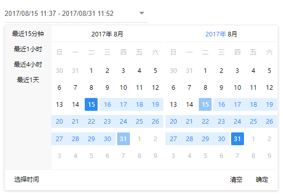
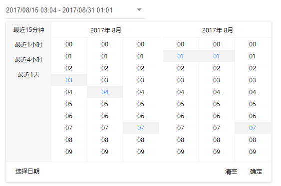

**ng-datetimerange-picker**
===================
一个全新的简洁美观的日期时间范围选择器（样式参考iviewui）

----------





Installation
-------------
bower:  
`bower install`  
npm:  
`npm install`

----------

Run
-------------
dev:  
`gulp serve`
build:  
`gulp`

Usage
-------------

a. 引入文件
```
  <link rel="stylesheet" href="../node_modules/ng-datetimerange-picker/dist/styles/ngDatetimeRangePicker.css">
  <script src="../node_modules/ng-datetimerange-picker/dist/scripts/ngDatetimeRangePicker.js"></script>
```

b. 在模块中进行依赖  
```
  angular.module('yourModule', ['ngDatetimeRangePicker'])
```

c. 使用指令`ng-date-picker`
```
  <ng-date-picker 
          id="test-picker"
          style="width: 280px;" 
          value="rctrl.dateConf.value" 
          format="{{rctrl.dateConf.format}}" 
          placeholder="{{rctrl.dateConf.placeholder}}" 
          options="rctrl.dateConf.options"
          on-ok="rctrl.okFunc(value)"
          on-clear="rctrl.clearFunc()"
          on-change="rctrl.changeFunc(value)"
          is-global="rctrl.dateConf.isGlobal"
          pos="cover"></ng-date-picker>
```
----------

Configurations
-------------

目前总共提供以下配置选项：

- [必选 Object] value：日期时间范围，格式为：{ start: moment(), end: moment()}
- [可选 String] format：格式，配置参考moment.js
- [可选 String] placeholder: 占位符
- [可选 Object] options：可选配置项
- [可选 Function] on-ok：点击确定回调的钩子函数（返回value参数）
- [可选 Function] on-clear：点击清空回调的钩子函数
- [可选 Function] on-change：当值发生变化时回调的钩子函数（返回value参数）
- [可选 Boolean] is-global: 是否应用到全局环境，默认为false，即相对input的位置出现。true情况下将添加到全局body中，此时不会被任何东西遮盖（比如父级的overhidden）
- [可选 Attribute] pos: 组件面板出现的位置。在is-global配置为true的情况下生效。选项分别为`center right cover cover-center cover-left cover-right`。

参考以下配置：

```javascript
this.okFunc = function(value){
    console.log('okkkkkkkkkk', value);
}
this.clearFunc = function(){
    console.log('clearrrrrrr');
}
this.changeFunc = function(value){
    console.log('changeeeeee', value);
}
this.dateConf = {
    isGlobal: true,
    value: {
        start: moment(),
        end: moment().month(11).add(1, 'y').add(2, 'd').add(13, 'h').add(2, 'm').add(3, 's')
    },
    format: 'YYYY-MM-DD HH:mm:ss',
    placeholder: '请选择日期范围',
    options: [{
            name: '今天',
            start: moment().startOf('day'),
            end: moment().endOf('day')
        },
        {
            name: '昨天',
            start: moment(),
            end: moment().subtract(1, 'd')
        },
        {
            name: '当前月',
            start: moment().startOf('month'),
            end: moment()
        },
        {
            name: '一年又两个月',
            start: moment().subtract(1, 'M'),
            end: moment().add(1, 'y').add(1, 'M')
        }
    ]
};
```
